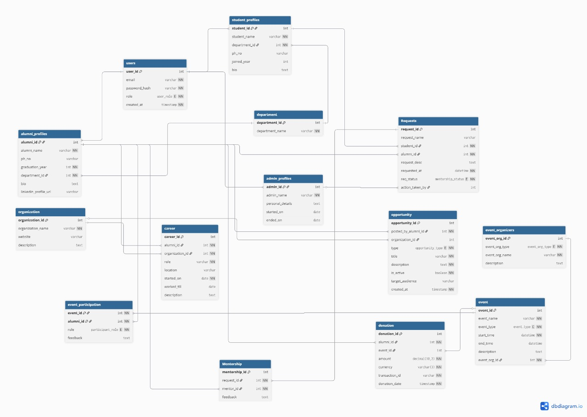

### Digital platform for centralised alumni managament and engagement

- This is a solution made by us for the SIH PS25017 titled as above

### Tech Stack
## Frontend
- Typescript
- ReactJs
- Bootstrap

## Backend
- Python
- FastAPI
- PostgreSQL (Supabase)

### Models diagram

### Contributors:
1. [V Hemanth](https://github.com/VUPPALA-HEMANTH)
2. [B Shanmukha Sri Krishna](https://github.com/wanderer3519)
3. [P Chakradhar Reddy](https://github.com/ChakradharReddy3237)
4. [G S S S Shashank](https://github.com/BluePheonixisHank)
5. [G Bhavani Shankar](https://github.com/GBhavaniShankar)
6. [Swadha Swaroop](https://github.com/Rocky0204)